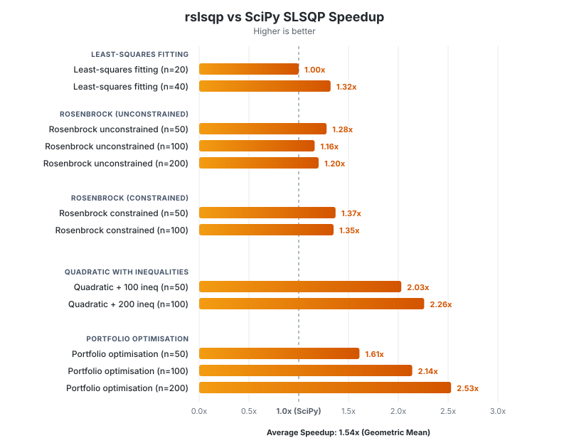

<p align="center">
  
</p>

# rslsqp

A **fast, pure-Rust reimplementation** of the classic SLSQP (Sequential
Least-Squares Quadratic Programming) optimiser — **1.5× faster than SciPy** on
average, up to **2.5× on constraint-heavy problems** — with seamless Python
bindings via PyO3.

Drop-in replacement for `scipy.optimize.minimize(method='SLSQP')`.  Change one
import line — get a faster solver.

## ✨ Features

- 🚀 **1.5× faster than SciPy** — benchmarked across 12 problems (Rosenbrock,
  portfolio optimisation, constrained quadratics, nonlinear least-squares).
  Up to **2.5× faster** on large, constraint-heavy problems.
- 🦀 **Pure-Rust solver core** — the entire iteration loop, BFGS update, QP
  sub-problem, and line-search run in compiled Rust; only objective/gradient
  callbacks cross the Python boundary.
- 🔌 **Drop-in SciPy replacement** — `from rslsqp import minimize` works
  exactly like `scipy.optimize.minimize(method='SLSQP')`.
- 🐍 **Pythonic OO interface** — `SlsqpSolver` with analytic or
  finite-difference gradients, iteration callbacks, and user-triggered abort.
- 🧮 **Optional BLAS acceleration** — link against macOS Accelerate or Linux
  OpenBLAS for even faster Level-1 / LAPACK operations.
- ⚡ **Zero-copy where possible** — 1-D arrays are shared between NumPy and
  Rust without copying.

## Installation

Install the package directly from PyPI. It includes precompiled, BLAS-accelerated binary wheels for Windows, Linux, and macOS:

```bash
uv add rslsqp
# or
pip install rslsqp
```

### Building from source (optional)

Building from source requires **Python ≥ 3.12**, a Rust toolchain, and [maturin](https://www.maturin.rs/):

```bash
# Clone and build
git clone https://github.com/oberbichler/rslsqp.git
cd rslsqp
uv sync
uv run maturin develop --release          # pure-Rust build
# — or —
uv run maturin develop --release --features blas   # with BLAS/Accelerate
```

Runtime dependency: **NumPy ≥ 2.4**.
For tests and benchmarks: **SciPy ≥ 1.17**.

## Quick start

```python
import numpy as np
from rslsqp import SlsqpSolver, GradientMode

def func(x):
    f = 100 * (x[1] - x[0]**2)**2 + (1 - x[0])**2
    c = np.array([1 - x[0]**2 - x[1]**2])   # inequality: c >= 0
    return f, c

def grad(x):
    g = np.array([
        -400 * (x[1] - x[0]**2) * x[0] - 2 * (1 - x[0]),
         200 * (x[1] - x[0]**2),
    ])
    a = np.array([[-2 * x[0], -2 * x[1]]])
    return g, a

solver = SlsqpSolver(
    func=func, grad=grad,
    xl=np.array([-1.0, -1.0]),
    xu=np.array([ 1.0,  1.0]),
    m=1, meq=0,
)
result = solver.optimize(np.array([0.1, 0.1]))
print(result.x, result.fun, result.success)
```

## SciPy-compatible interface

`rslsqp.minimize` is a **drop-in replacement** for
`scipy.optimize.minimize(method='SLSQP')`.  It accepts the same arguments and
returns a compatible `OptimizeResult`:

```python
from rslsqp import minimize

result = minimize(
    fun, x0,
    jac=jac,                 # callable, True, '2-point', '3-point'
    bounds=bounds,           # sequence of (lo, hi) or scipy.optimize.Bounds
    constraints=constraints, # list of {'type': 'eq'/'ineq', 'fun': …, 'jac': …}
    options={'maxiter': 200, 'ftol': 1e-10},
)
print(result.x, result.fun, result.nit, result.success)
```

Switching from SciPy requires changing only the import line:

```diff
- from scipy.optimize import minimize
+ from rslsqp import minimize
```

## API overview

### Enums

| Enum | Values | Description |
|------|--------|-------------|
| `GradientMode` | `USER`, `FORWARD`, `BACKWARD`, `CENTRAL` | How gradients are supplied or approximated |
| `LinesearchMode` | `INEXACT`, `EXACT` | Line-search strategy |
| `NnlsMode` | `NNLS`, `BVLS` | Non-negative least-squares sub-solver |
| `SlsqpStatus` | `CONVERGED`, `MAX_ITERATIONS_REACHED`, … | Solver exit status |

### Classes

| Class | Description |
|-------|-------------|
| `SlsqpSolver` | OO interface — configure once, call `optimize(x0)` |
| `SlsqpResult` | Result of `SlsqpSolver.optimize()` (`x`, `fun`, `constraints`, `status`, `iterations`, `success`) |
| `OptimizeResult` | SciPy-compatible result from `minimize()` (`x`, `fun`, `jac`, `nit`, `nfev`, `njev`, `success`, `message`) |

## Benchmark: rslsqp vs SciPy SLSQP

<p align="center">
  
</p>

All benchmarks run with the **`blas` feature enabled** (macOS Accelerate on
Apple Silicon).  Both solvers receive identical analytic gradients so the
comparison isolates solver-core overhead.

> **Environment:** Python 3.12, NumPy 2.4, SciPy 1.17 — Apple Silicon (arm64),
> macOS — release build with `--features blas` — 10 timed runs, 2 warm-up,
> `maxiter=500`, `ftol=1e-10`.

| Problem | n | Constraints | SciPy (ms) | rslsqp (ms) | Speedup |
|---------|--:|------------:|-----------:|------------:|--------:|
| Rosenbrock unconstrained | 50 | 0 | 14.85 | 11.58 | **1.28×** |
| Rosenbrock unconstrained | 100 | 0 | 62.71 | 54.14 | **1.16×** |
| Rosenbrock unconstrained | 200 | 0 | 231.06 | 191.80 | **1.20×** |
| Rosenbrock constrained | 50 | 2 | 11.87 | 8.67 | **1.37×** |
| Rosenbrock constrained | 100 | 2 | 50.67 | 37.54 | **1.35×** |
| Portfolio optimisation | 50 | 2 | 8.32 | 5.18 | **1.61×** |
| Portfolio optimisation | 100 | 2 | 63.92 | 29.84 | **2.14×** |
| Portfolio optimisation | 200 | 2 | 494.26 | 195.14 | **2.53×** |
| Quadratic + 100 ineq | 50 | 100 | 33.15 | 16.33 | **2.03×** |
| Quadratic + 200 ineq | 100 | 200 | 266.12 | 117.99 | **2.26×** |
| Least-squares fitting | 20 | 1 | 1.35 | 1.34 | **1.00×** |
| Least-squares fitting | 40 | 1 | 0.85 | 0.64 | **1.32×** |

**Geometric mean speedup: 1.54×**

The advantage grows with problem size and constraint count — for
constraint-heavy problems at n = 100–200 the Rust core is **2–2.5× faster**
than SciPy's Fortran-based SLSQP.

To reproduce:

```bash
uv run maturin develop --release --features blas
uv run python benchmarks/benchmark.py
```

## BLAS acceleration (optional)

On macOS (Accelerate) or Linux (OpenBLAS), build with the `blas` feature
for faster BLAS Level 1 operations and LAPACK-accelerated QR:

```bash
uv run maturin develop --release --features blas
```

## Development

```bash
# Install in editable mode (requires maturin + uv)
uv sync
uv run maturin develop --release

# Run tests
uv run pytest

# Run benchmarks
uv run python benchmarks/benchmark.py
```

A [`justfile`](justfile) is provided for common tasks:

```bash
just release          # build in release mode
just release-blas     # build with BLAS/Accelerate
just test             # run Rust + Python tests
just benchmark-blas   # benchmark with BLAS enabled
just lint             # lint Rust + Python
just fmt              # format all code
```

## Licence

BSD-3-Clause — see [LICENSE](LICENSE) for details.

Based on the SLSQP algorithm by Dieter Kraft (1988), modernised in Fortran by
Jacob Williams ([slsqp](https://github.com/jacobwilliams/slsqp), BSD-3-Clause).
